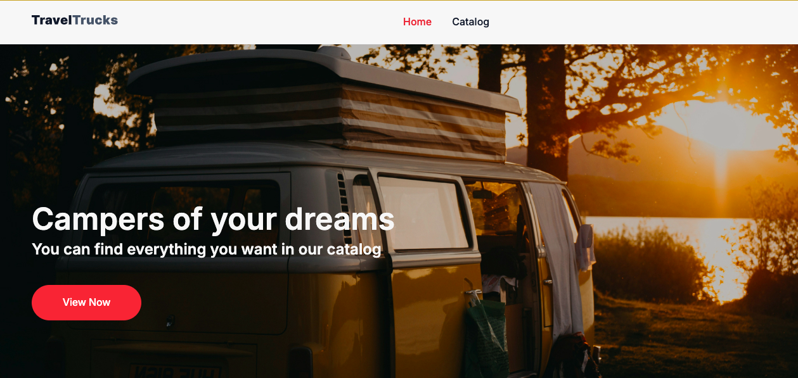

# TravelTrucks

<!-- </p> -->



---

**TravelTrucks** — це веб-додаток для оренди кемперів, який дозволяє користувачам переглядати каталог транспортних засобів, фільтрувати їх за різними критеріями, переглядати деталі обраного кемпера, а також здійснювати бронювання. Проєкт побудований з використанням **React**, **Redux**, та **Vite**, що забезпечує сучасний інтерфейс і зручність використання.

## Особливості додатку

- **Каталог кемперів**: відображення списку доступних кемперів з можливістю фільтрації за різними параметрами (тип кузова, наявність кондиціонера тощо).
- **Деталі кемпера**: детальна сторінка з описом, характеристиками, галереєю та відгуками користувачів.
- **Форма бронювання**: зручний інтерфейс для бронювання кемпера.
- **Рейтинг та відгуки**: перегляд відгуків інших користувачів з оцінками кемпера за п'ятизірковою шкалою.

## Вимоги до системи

Для запуску проєкту необхідно мати встановлені наступні компоненти:

- **Node.js** версії 16.0.0 або вище
- **npm** або **yarn**

## Запуск проекту

### 1. Клонування репозиторію

Клонуйте репозиторій за допомогою Git:

```bash
git clone https://github.com/Lyfenko/TravelTrucks.git
Перейдіть до директорії проекту:

cd travel_trucks

2. Встановлення залежностей
Встановіть всі необхідні залежності за допомогою npm або yarn:

npm install

3. Запуск у режимі розробки
Щоб запустити проект у режимі розробки, виконайте команду:

npm run dev

Проект буде доступний за адресою http://localhost:3000.

4. Попередній перегляд продакшену
Щоб переглянути зібрану версію перед деплоєм, запустіть команду:

npm run preview

Технології

React — фреймворк для побудови інтерфейсів користувача
Redux Toolkit — для управління станом додатку
React Router — для маршрутизації між сторінками
Axios — для виконання HTTP-запитів до бекенду
Formik & Yup — для обробки та валідації форм
CSS модулі — для локальних стилів компонентів
Vite — для швидкого збірника проєктів

Структура проекту

src
├── assets                # Зображення, іконки
├── components            # Повторювані компоненти
│   ├── App
│   ├── BookingForm
│   │── CamperDetail
│   ├── CamperFeatures
│   ├── CamperItem
│   ├── CamperReviews
│   ├── CampersList
│   ├── FeatureItem
│   ├── FeatureItemList
│   ├── Filters
│   ├── ImageGallery
│   ├── Loader
│   ├── LocationPicklist
│   ├── Navigation
│   ├── RatingBar
│   ├── RatingLocation
├── helpers               # Обробка та форматування текстових даних і запитів для фільтрації
├── pages                 # Сторінки додатку
│   ├── CamperDetailsPage
│   ├── CatalogPage
│   ├── HomePage
│   └── NotFoundPage
├── redux                 # Стан додатку (Redux)
│   ├── campers           # Стан кемперів
│   ├── filters           # Фільтри каталогу
│   └── store.js          # Конфігурація Redux Store
└── index.css             # Глобальні стилі
└── main.jsx              # Точка входу

Проєкт використовує сторонній API для роботи з даними про кемпери:

GET /campers — отримати всі оголошення
GET /campers/:id — отримати деталі конкретного оголошення